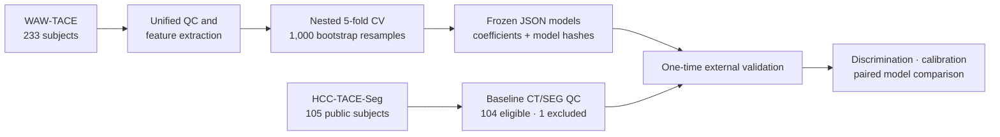
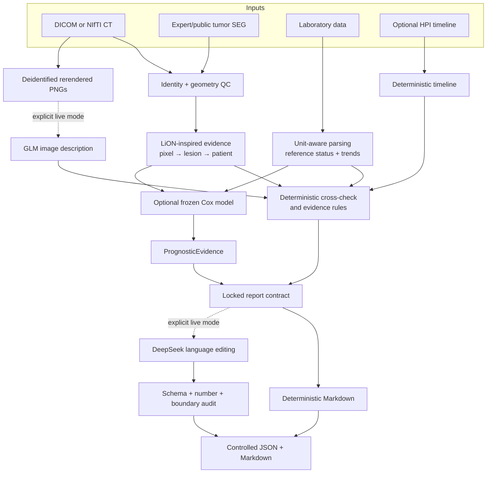

# OncoFuse

### Auditable multimodal evidence and survival-risk research for hepatocellular carcinoma

[简体中文](README.zh-CN.md) · English

[](https://github.com/xhu014183-cmd/OncoFuse/actions/workflows/ci.yml)
[](https://www.python.org/)
[](tests/)
[](pyproject.toml)
[](docs/RELEASE_v0.4.0.md)
[](LICENSE)

**OncoFuse is a research-only platform that turns 3D liver CT, expert tumor
segmentations, laboratory measurements, and clinical context into traceable evidence,
frozen survival-risk models, and controlled reports.** It is designed to fail closed:
unverifiable geometry, units, patient pairing, model output, or provenance produces an
explicit warning or rejection—not a fabricated clinical answer.

> **Important:** this repository is not a clinical device. It does not replace
> radiologists, diagnose HCC, assign LI-RADS/BCLC/RECIST/mRECIST, estimate an
> individual's remaining lifetime, or recommend treatment.

---

## Why this project matters

Medical-AI prototypes often end at a model score or a fluent report. OncoFuse treats
the complete evidence path as the product:

1. **Measure first.** CT and SEG are checked in patient space before any lesion number
   is calculated.
2. **Separate evidence from outcomes.** Survival labels never enter feature tables,
   GLM prompts, DeepSeek prompts, or single-case inference.
3. **Freeze before external validation.** Preprocessing, feature order, coefficients,
   thresholds, and model hashes are fixed before the external cohort is opened.
4. **Constrain language models.** GLM may describe deidentified rendered images;
   DeepSeek may improve wording. Neither decides the risk score or changes locked
   evidence.
5. **Keep unfavorable results.** The external study did not show that the current
   imaging features improve the clinical baseline. That result is reported rather
   than tuned away.

## Two complementary research tracks

| Track | Question | Inputs | Output |
|---|---|---|---|
| LiON-inspired evidence reporting | What quantitative and visible evidence is present in this case? | Single-phase CT, optional expert/public SEG, labs, optional HPI | Pixel → lesion → patient evidence, cross-check, controlled report |
| Public HCC-TACE prognosis study | Among patients already diagnosed with HCC, how well can baseline evidence rank post-TACE overall-survival risk? | Age, sex, AFP, harmonized CT/SEG morphology | Frozen penalized Cox models and independent external validation |

The first track borrows LiON's hierarchical evidence-engineering idea; it is **not a
LiON reproduction**. The second track predicts research-level relative risk in an
already diagnosed HCC population; it is **not an HCC diagnostic classifier**.

## Formal public-cohort study



### Prespecified models

- `clinical_core`: age, sex, `log1p(AFP)`
- `imaging_core`: lesion count, total tumor volume, maximum 3D bounding-box
  extent, and largest-lesion sphericity
- `fused_core`: all seven features
- `fused_extended`: WAW-only exploratory liver-function model; no external claim

The primary models use the same low-dimensional SEG algorithm in both cohorts. They
do not use dataset-specific high-dimensional radiomics, post-treatment response,
progression, number of TACE sessions, or follow-up information.

### Results

| Model | WAW nested out-of-fold C-index (95% CI) | HCC-TACE-Seg external C-index (95% CI) |
|---|---:|---:|
| Clinical core | 0.5917 (0.5484–0.6373) | 0.5860 (0.5065–0.6579) |
| Imaging core | 0.6047 (0.5583–0.6490) | 0.5467 (0.4746–0.6094) |
| Fused core | **0.6310** (0.5830–0.6725) | 0.5819 (0.5131–0.6516) |

External test: **104 subjects, 92 events**. One subject was excluded before model
evaluation because the baseline CT had missing/non-uniform slices; no interpolation
was performed.

- Fused minus clinical: **−0.0041** (95% CI −0.0766 to 0.0671)
- Fused minus imaging: **0.0352** (95% CI 0.0029 to 0.0691)

**Interpretation:** the current low-dimensional imaging features did not add external
discrimination beyond age, sex, and AFP. External calibration showed cohort shift,
and proportional-hazards screening flagged age, sex, or lesion-count terms in one or
more primary models. No post-external-test tuning was performed.

This is an honest null incremental result—not evidence of clinical utility. The
research contribution is the reproducible, leakage-controlled external-validation
workflow and its auditable failure analysis.

See the [prespecified protocol](docs/HCC_PUBLIC_OS_PROTOCOL.md),
[experiment log](docs/HCC_PUBLIC_OS_EXPERIMENT_LOG.md),
[data card](docs/HCC_PUBLIC_OS_DATA_CARD.md), and
[bilingual model card](docs/HCC_PUBLIC_OS_MODEL_CARD.md).

## System architecture



### Model responsibilities

| Component | Allowed | Never allowed |
|---|---|---|
| SEG measurement | Geometry-validated lesion quantification | Diagnosis probability or invented segmentation |
| GLM vision | Describe visible findings from rerendered PNGs | Receive AFP, outcomes, risk scores, DICOM metadata, or patient identifiers |
| Cox model | Produce frozen relative-risk evidence | Diagnose HCC or estimate remaining months |
| DeepSeek | Edit language around locked evidence | Change numbers, evidence lists, model identity, limitations, or clinical verdicts |

External model calls are disabled by default. Provider failure leaves a complete
deterministic report and a degraded audit state; it never becomes a fake AI success.

## Quick start

### 1. Install

```powershell
git clone https://github.com/xhu014183-cmd/OncoFuse.git
cd OncoFuse
python -m venv .venv
.\.venv\Scripts\Activate.ps1
python -m pip install --upgrade pip
pip install -e ".[dev,research]"
```

Python 3.11 and 3.12 are supported. The deterministic demo does not require a GPU or
an API key.

### 2. Run the fully synthetic, offline demo

```powershell
hcc-demo run-demo --output demo-output
```

Expected research verdict: `concordant_progression_signal`. It is a contract test on
synthetic data, not clinical performance evidence.

### 3. Run quality checks

```powershell
python -m ruff check .
python -m mypy src
python -m pytest -q --cov=hcc_multimodal --cov-branch
```

Current verified baseline: **268 passed, 3 skipped, 76.31% branch coverage**.

## Single-case LiON-inspired report

Update the image and SEG paths in the example case, then run the offline path:

```powershell
hcc-demo run-report `
  --case-input examples\case_input.recommended.json `
  --output case-output `
  --glm-mode off `
  --report-mode deterministic
```

The report labels the evidence as `LiON-inspired / precomputed-mask`. A missing SEG
means “quantification unavailable,” never “no lesion.” Single-phase CT cannot establish
a complete dynamic enhancement pattern.

## Reproduce the prognosis study

Install public-data support and review both source licenses before downloading:

```powershell
pip install -e ".[dev,public-data,research]"

$researchDataRoot = "E:\hcc-public-data"
$researchOutputRoot = "E:\hcc-research-output"

hcc-demo sync-prognosis-data --dataset waw-tace `
  --tier metadata --data-root $researchDataRoot --accept-license

hcc-demo sync-prognosis-data --dataset hcc-tace-seg `
  --tier pilot --data-root $researchDataRoot --accept-license

hcc-demo build-prognosis-cohort `
  --data-root $researchDataRoot `
  --output "$researchOutputRoot\cohort"

hcc-demo train-prognosis-model `
  --cohort "$researchOutputRoot\cohort\development-cohort.json" `
  --output "$researchOutputRoot\models" `
  --seed 1729 --bootstrap-iterations 1000
```

Only after inspecting QC, exclusions, folds, internal results, and frozen hashes should
the full external cohort be prepared and explicitly unlocked. Follow the complete
[clean-directory reproduction guide](docs/HCC_PUBLIC_OS_REPRODUCIBILITY.md).

Raw datasets and generated research outputs are Git-ignored and must remain outside
the repository.

## Single-case prognosis report

After a model has been frozen:

```powershell
hcc-demo run-prognosis-report `
  --case-input examples\prognosis_case_input.json `
  --model research-output\models\model-bundle-fused.json `
  --output prognosis-output `
  --glm-mode off `
  --report-mode deterministic
```

The output contains a relative risk index, WAW reference percentile, research-only
median risk group, model hash, applicability checks, and limitations. It intentionally
does not provide an individual life-expectancy estimate.

## Optional GLM and DeepSeek orchestration

Live calls require explicit mode flags and environment-only credentials:

```powershell
$env:ZHIPU_API_KEY = "<set outside Git>"
$env:ZHIPU_BASE_URL = "https://open.bigmodel.cn/api/paas/v4"
$env:ZHIPU_VISION_MODEL = "glm-4.6v-flash"

$env:DEEPSEEK_API_KEY = "<set outside Git>"
$env:DEEPSEEK_BASE_URL = "<provider-compatible base URL>"
$env:DEEPSEEK_MODEL = "<configured model>"

hcc-demo run-report `
  --case-input examples\case_input.recommended.json `
  --output case-output-live `
  --glm-mode live `
  --report-mode live `
  --require-live-models
```

- GLM receives only locally rerendered, deidentified PNGs and anonymous lesion IDs.
- Reasoning-only DeepSeek models are routed to a number-free narrative path; stable
  JSON-capable non-reasoning models are preferred for structured report rendering.
- API keys are never written to prompts, reports, audits, model bundles, or Web health
  responses.

## Local Web interface

```powershell
hcc-demo vlm-web --port 7861
```

Open `http://127.0.0.1:7861/`. The local service provides:

- axial CT browsing with SEG overlay;
- laboratory trends and treatment-aligned timelines;
- LiON-inspired quantitative evidence and imaging cross-checks;
- deterministic or controlled-LLM reports;
- `POST /api/interpret` for the evidence-report track;
- `POST /api/prognosis` for the frozen prognosis track;
- provider configuration status without secret disclosure.

The service binds to localhost and is not a hosted clinical application.

## Key artifacts

```text
cohort/
├── dataset-manifest.json
├── cohort-qc.json
├── development-features.csv       # predictors only
├── development-endpoints.csv      # OS labels only
├── external-test-features.csv
├── external-test-endpoints.csv
├── exclusion-manifest.json
└── source-unit-audit.json

models/
├── split-manifest.json
├── model-bundle-clinical.json
├── model-bundle-imaging.json
├── model-bundle-fused.json
└── internal-validation.json

external/
├── external-unlock-audit.json
├── external-validation.json
├── model-comparison.json
└── figures/

case-output/
├── lion-inspired-evidence.json
├── glm-imaging-evidence.json
├── prognostic-evidence.json
├── controlled-prognosis-report.json
├── controlled-prognosis-report.md
└── provider-audit/
```

Every authoritative artifact is human-readable. Model bundles use JSON rather than
opaque pickle files.

## Documentation

| Document | Purpose |
|---|---|
| [HCC public OS protocol](docs/HCC_PUBLIC_OS_PROTOCOL.md) | Prespecified cohort, endpoint, features, and statistics |
| [Reproducibility guide](docs/HCC_PUBLIC_OS_REPRODUCIBILITY.md) | Commands from an empty data/output directory |
| [Model card](docs/HCC_PUBLIC_OS_MODEL_CARD.md) | Intended use, results, limitations, and prohibited claims |
| [Data card](docs/HCC_PUBLIC_OS_DATA_CARD.md) | Dataset scope, licenses, fields, and exclusions |
| [Experiment log](docs/HCC_PUBLIC_OS_EXPERIMENT_LOG.md) | Append-only successful and unfavorable runs |
| [LiON-inspired implementation plan](docs/LION_INSPIRED_HCC_PIPELINE_PLAN.md) | Evidence and reporting design |
| [Case-input specification](docs/CASE_INPUT_SPEC.md) | Versioned single-case contract |
| [Three-line evidence pipeline](docs/THREE_LINE_PIPELINE.md) | Imaging, laboratory, and HPI orchestration |
| [Data sources](DATA_SOURCES.md) | Public-data provenance and governance |
| [Model sources](MODEL_SOURCES.md) | External model provenance and boundaries |

## Repository layout

```text
src/hcc_multimodal/   validated contracts, QC, modeling, reporting, CLI and Web service
tests/                 synthetic geometry, leakage, model, LLM-safety and API tests
examples/              synthetic inputs and versioned case templates
docs/                  protocol, cards, runbooks, study summary and local demo
schemas/               exported public JSON Schemas
```

## Public data and attribution

- [WAW-TACE](https://zenodo.org/records/12741586): development cohort, 233 subjects
- [HCC-TACE-Seg](https://www.cancerimagingarchive.net/collection/hcc-tace-seg/):
  locked external cohort, 105 public subjects
- [LiON publication](https://www.nature.com/articles/s41591-026-04589-y): conceptual
  inspiration for hierarchical liver evidence
- [Public PLAN framework](https://github.com/alibaba-damo-academy/pixel-lesion-patient-network):
  future backend reference, not bundled or executed here

Users must review and accept source-dataset terms independently. This repository does
not redistribute raw public imaging, patient-level source tables, model weights, or
API credentials.

## Intended use and limitations

OncoFuse is an **auditable research prototype for externally validated multimodal HCC
survival-risk stratification after TACE**. The current external discrimination is weak,
fusion did not outperform the clinical core, and calibration shifted across cohorts.
The study is retrospective, depends on public expert segmentations, and has not been
prospectively or clinically validated.

Use it to study evidence engineering, multimodal orchestration, leakage control,
survival-model validation, and controlled reporting—not to make patient-care decisions.

## License

Source code is released under the [MIT License](LICENSE). Public datasets and external
models retain their own licenses and attribution requirements.
