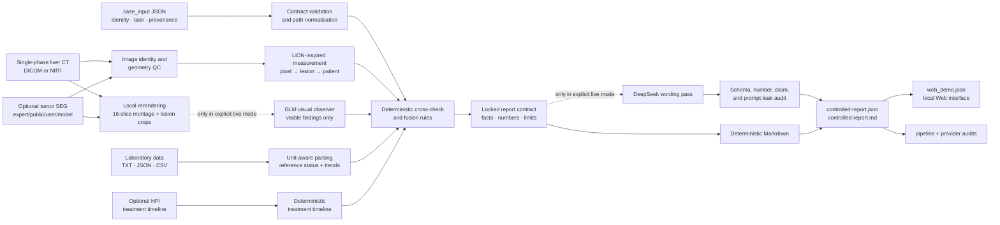
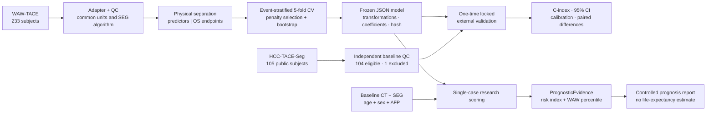

# OncoFuse

### Auditable HCC multimodal evidence, external validation, and controlled reporting

[简体中文](README.zh-CN.md) · English

[](https://github.com/xhu014183-cmd/OncoFuse/actions/workflows/ci.yml)
[](https://www.python.org/)
[](tests/)
[](pyproject.toml)
[](docs/RELEASE_v0.4.0.md)
[](LICENSE)

**OncoFuse turns liver CT, tumor segmentation, laboratory evidence, and clinical
context into traceable measurements, research-level survival-risk evidence, and a
human-readable report whose facts remain locked.**

The repository contains two connected but scientifically distinct workflows:

| Workflow | Input | Core computation | Final output |
|---|---|---|---|
| Single-case evidence report | CT, optional tumor SEG, longitudinal labs, optional HPI | Geometry QC, LiON-inspired lesion measurement, optional GLM observation, deterministic evidence fusion | Audited JSON, readable Markdown, and Web payload |
| Public-cohort prognosis study | WAW-TACE development cohort and HCC-TACE-Seg external cohort | Leakage-controlled Cox modeling and one-time external validation | Frozen JSON models, metrics, confidence intervals, figures, and model card |

> **Research use only.** OncoFuse is not a medical device. It does not diagnose HCC,
> assign LI-RADS/BCLC/RECIST/mRECIST, estimate an individual's remaining lifetime, or
> recommend treatment. The current workflow depends on supplied reference
> segmentations and has not been prospectively validated.

## 1. Complete single-case input-to-output chain

The final report is not produced by sending all raw data to one language model. Each
input first becomes a validated, traceable evidence object. Deterministic rules decide
the evidence state. DeepSeek may improve wording only after those facts are locked.



### What each stage receives and produces

| Stage | Receives | Produces | Fail-closed behavior |
|---|---|---|---|
| Case contract | Versioned JSON and file references | Normalized case identity, task, and data relationship | Invalid versions, ambiguous paths, or illegal combinations are rejected |
| Imaging QC | CT and optional SEG | Orientation, spacing, shape, alignment, and provenance checks | Misaligned or empty masks cannot become trusted lesion measurements |
| LiON-inspired backend | Geometry-validated CT/SEG | Mask hash; lesion IDs, volumes, 3D extents and centroids; patient tumor burden | Missing SEG means **measurement unavailable**, never “zero lesions” |
| GLM observer | Only rerendered, deidentified PNGs and anonymous lesion IDs | Structured visible findings, uncertainty, image references, and provider audit | Diagnosis claims, unknown lesion IDs, invented numbers, extra fields, or API failure are blocked |
| Laboratory/HPI pipeline | Baseline/serial labs and optional clinical timeline | Normalized units, reference status, trends, liver-reserve evidence, and treatment anchors | Unsupported units and missing values remain explicit |
| Cross-check and rules | Validated imaging, GLM, labs, HPI, and provenance | Supporting, conflicting and missing evidence; reason codes; review flag | GLM and SEG are not counted as two independent modalities and probabilities are not averaged |
| Report lock | Deterministic verdict and audited evidence | `ControlledReport` with immutable numbers, lists, status, limits, and disclaimer | A report that fails its contract is rejected |
| DeepSeek | Compact locked report content only | Optional, more readable narrative | It cannot change evidence or numbers; failure falls back to deterministic Markdown and is marked degraded |

### Input contract

The recommended `case_input` 1.2 contract references data on disk; it does not embed
raw images in JSON.

```json
{
  "schema_version": "1.2.0",
  "case_id": "CASE_001",
  "patient_id": "RESEARCH_001",
  "clinical_task": "recurrence_surveillance",
  "index_date": "2026-07-20",
  "data_relationship": {
    "imaging_origin": "real_public",
    "laboratory_origin": "synthetic",
    "pairing_status": "unpaired_poc_composite",
    "statement": "Public imaging and synthetic laboratory data are combined only for a software demonstration"
  },
  "imaging": {
    "source_type": "nifti",
    "nifti_image": "ct.nii.gz",
    "dicom_dir": null,
    "seg": "tumor_mask.nii.gz",
    "seg_role": "public_reference",
    "study_date": "2026-07-20",
    "phase": "portal_venous"
  },
  "laboratory": {
    "source_type": "file",
    "file_path": "labs.txt"
  },
  "hpi": {
    "source_type": "file",
    "file_path": "hpi.txt"
  }
}
```

Rules that matter:

- DICOM requires `dicom_dir`; NIfTI requires `nifti_image`; the two are mutually
  exclusive.
- The LiON-inspired v1 path accepts one CT examination and one phase. Single-phase CT
  cannot establish a complete dynamic enhancement pattern.
- SEG is optional for evidence reporting. Its absence disables quantification rather
  than creating a negative finding.
- Public imaging paired with fabricated labs must be declared
  `unpaired_poc_composite`; the report permanently displays that limitation.
- GLM never receives laboratory values, HPI, outcomes, or risk scores.

See the full [case-input specification](docs/CASE_INPUT_SPEC.md) and the
[recommended example](examples/case_input.recommended.json).

### Output contract

One `run-report` execution preserves every intermediate decision, not only the final
prose:

```text
case-output/
├── case-input.normalized.json       # resolved, versioned input contract
├── imaging-input-qc.json            # image/SEG geometry and source checks
├── lion-inspired-evidence.json      # pixel, lesion, and patient measurements
├── glm-imaging-evidence.json        # validated visible findings or unavailable state
├── imaging-crosscheck.json          # lesion coverage and structural conflicts
├── clinical-lab-evidence.json       # normalized values and longitudinal trends
├── clinical-verdict.json            # deterministic fusion decision and rule traces
├── deepseek-prompt.json             # compact structured rendering request
├── deepseek-narrative-prompt.json   # optional prose-only request
├── deepseek-narrative.json          # accepted narrative or blocked/unavailable state
├── controlled-report.json           # authoritative machine-readable report
├── controlled-report.md             # human-readable report
├── web_demo.json                    # payload used by the local Web interface
├── pipeline-audit.json              # modes, timing, degradation, artifact index
└── provider-audit/
    ├── glm.json                     # provider/model/status; never the API key
    └── deepseek.json
```

The authoritative report contains imaging and laboratory summaries, a multimodal
assessment, supporting/conflicting/missing evidence, uncertainty, data-quality status,
human-review requirement, intended use, and a fixed research disclaimer.

## 2. Complete prognosis-research chain

This workflow asks a different question: among patients already diagnosed with HCC
and treated with first TACE, can baseline clinical and tumor-burden features rank
overall-survival risk? It does not diagnose HCC.



### Prespecified inputs and models

| Model | Baseline predictors |
|---|---|
| `clinical_core` | Age, sex, `log1p(AFP ng/mL)` |
| `imaging_core` | 26-connected lesion count, total tumor volume, maximum 3D extent, largest-lesion sphericity |
| `fused_core` | All seven clinical and imaging features |
| `fused_extended` | WAW-only exploratory liver-function features; no external-validation claim |

Outcome status and survival time are stored separately from predictors. Treatment
response, progression, follow-up values, and number of TACE sessions are forbidden as
features and are never sent to GLM or DeepSeek. Both cohorts use the same low-dimensional
SEG algorithm instead of incompatible dataset-specific radiomics.

### External-validation result

| Model | WAW nested out-of-fold C-index (95% CI) | HCC-TACE-Seg external C-index (95% CI) |
|---|---:|---:|
| Clinical core | 0.5917 (0.5484–0.6373) | 0.5860 (0.5065–0.6579) |
| Imaging core | 0.6047 (0.5583–0.6490) | 0.5467 (0.4746–0.6094) |
| Fused core | **0.6310** (0.5830–0.6725) | 0.5819 (0.5131–0.6516) |

External evaluation included 104 subjects and 92 events. One case was excluded before
evaluation because baseline CT slices were missing/non-uniform; no interpolation was
used.

- Fused minus clinical: **−0.0041** (95% CI −0.0766 to 0.0671)
- Fused minus imaging: **0.0352** (95% CI 0.0029 to 0.0691)

The current four morphology features did **not** improve external discrimination over
age, sex, and AFP. Calibration shifted between cohorts, and proportional-hazards
screening raised warnings for some terms. No feature selection, threshold change, or
recalibration was performed after seeing the external result. This honest null
incremental result is part of the project, not hidden.

### Research outputs

```text
cohort/
├── dataset-manifest.json
├── cohort-qc.json
├── development-features.csv         # predictors only
├── development-endpoints.csv        # OS labels only
├── external-test-features.csv
├── external-test-endpoints.csv
├── exclusion-manifest.json
└── source-unit-audit.json

models/
├── split-manifest.json
├── model-bundle-clinical.json
├── model-bundle-imaging.json
├── model-bundle-fused.json
├── internal-validation.json
└── model-card.md

external/
├── external-unlock-audit.json
├── external-validation.json
├── model-comparison.json
└── figures/

prognosis-output/
├── case-input.normalized.json
├── lion-inspired-evidence.json
├── glm-imaging-evidence.json
├── prognostic-evidence.json
├── controlled-prognosis-report.json
├── controlled-prognosis-report.md
├── deepseek-narrative.json
├── pipeline-audit.json
└── provider-audit/
```

Model bundles are transparent JSON files containing feature order, fitted transforms,
coefficients, baseline risk, development-risk distribution, validation state, cohort
version, and hashes—never opaque pickle files.

## 3. Responsibilities and trust boundaries

| Component | Responsible for | Not allowed to do |
|---|---|---|
| Reference SEG + measurement code | Reproducible tumor geometry and burden | Automatic diagnosis, malignancy probability, or invented segmentation |
| LiON-inspired adapter | Pixel → lesion → patient evidence contract | Claim to reproduce the unpublished clinical LiON system |
| GLM vision | Describe visible findings in rerendered images | See AFP/OS/risk; diagnose, stage, recommend treatment, or invent measurements |
| Deterministic rules | Resolve evidence state, conflicts, missingness, and review requirement | Hide uncertainty or treat model agreement as independent confirmation |
| Frozen Cox model | Produce a relative risk index and development-cohort percentile | Diagnose HCC or predict remaining survival months |
| DeepSeek | Improve readability after evidence is locked | Decide the verdict or alter facts, numbers, model identity, and limitations |

In short: **measurement code creates quantitative evidence, GLM adds constrained
visual observations, rules perform fusion, the frozen Cox model computes research
risk, and DeepSeek edits language.**

## 4. Run the project

### Install

```powershell
git clone https://github.com/xhu014183-cmd/OncoFuse.git
cd OncoFuse
python -m venv .venv
.\.venv\Scripts\Activate.ps1
python -m pip install --upgrade pip
pip install -e ".[dev,research]"
```

Python 3.11 and 3.12 are tested. The offline path needs no GPU and no API key.

### Run a fully synthetic offline check

```powershell
hcc-demo run-demo --output demo-output
```

This validates contracts and orchestration with synthetic data; it is not a clinical
performance demonstration.

### Run the single-case report offline

After replacing paths in the example:

```powershell
hcc-demo run-report `
  --case-input examples\case_input.recommended.json `
  --output case-output `
  --glm-mode off `
  --report-mode deterministic
```

### Enable GLM and DeepSeek explicitly

Credentials must remain in environment variables and outside Git:

```powershell
$env:ZHIPU_API_KEY = "<set locally>"
$env:ZHIPU_BASE_URL = "https://open.bigmodel.cn/api/paas/v4"
$env:ZHIPU_VISION_MODEL = "glm-4.6v-flash"

$env:DEEPSEEK_API_KEY = "<set locally>"
$env:DEEPSEEK_BASE_URL = "<OpenAI-compatible provider URL>"
$env:DEEPSEEK_MODEL = "<configured model>"

hcc-demo run-report `
  --case-input examples\case_input.recommended.json `
  --output case-output-live `
  --glm-mode live `
  --report-mode live `
  --require-live-models
```

Only locally rerendered, deidentified PNGs are sent to GLM. Raw DICOM, paths, patient
identifiers, labs, and outcomes are excluded. DeepSeek receives compact locked evidence,
not CT pixels or masks. API failure produces an explicit degraded audit and a complete
deterministic fallback.

### Run a report from a frozen prognosis model

```powershell
hcc-demo run-prognosis-report `
  --case-input examples\prognosis_case_input.json `
  --model research-output\models\model-bundle-fused.json `
  --output prognosis-output `
  --glm-mode off `
  --report-mode deterministic
```

### Reproduce the public-cohort study

```powershell
pip install -e ".[dev,public-data,research]"

$researchDataRoot = "E:\hcc-public-data"
$researchOutputRoot = "E:\hcc-research-output"

hcc-demo sync-prognosis-data --dataset waw-tace `
  --tier metadata --data-root $researchDataRoot --accept-license

hcc-demo sync-prognosis-data --dataset hcc-tace-seg `
  --tier pilot --data-root $researchDataRoot --accept-license

hcc-demo build-prognosis-cohort `
  --data-root $researchDataRoot `
  --output "$researchOutputRoot\cohort"

hcc-demo train-prognosis-model `
  --cohort "$researchOutputRoot\cohort\development-cohort.json" `
  --output "$researchOutputRoot\models" `
  --seed 1729 --bootstrap-iterations 1000

# Inspect QC, exclusions, folds, internal results, and frozen model hashes here.
# Only then prepare the complete external cohort:
hcc-demo sync-prognosis-data --dataset hcc-tace-seg `
  --tier full --data-root $researchDataRoot --accept-license

hcc-demo build-prognosis-cohort `
  --data-root $researchDataRoot `
  --output "$researchOutputRoot\cohort-frozen"

hcc-demo evaluate-prognosis-model `
  --cohort "$researchOutputRoot\cohort-frozen\external-test-cohort.json" `
  --models "$researchOutputRoot\models" `
  --output "$researchOutputRoot\external" `
  --unlock-external --seed 1729 --bootstrap-iterations 1000
```

Review the licenses, QC, exclusions, split manifest, internal results, and frozen model
hashes before unlocking the external cohort. Follow the
[clean-directory reproduction guide](docs/HCC_PUBLIC_OS_REPRODUCIBILITY.md). Raw data
and generated study outputs are Git-ignored and should remain outside the repository.

### Start the local Web interface

```powershell
hcc-demo vlm-web --port 7861
```

Open `http://127.0.0.1:7861/`. The local interface provides CT slice viewing with SEG
overlay, laboratory trends, treatment-aligned timelines, LiON-inspired evidence,
cross-check status, controlled reports, and provider audits.

- `POST /api/interpret`: evidence-report workflow
- `POST /api/prognosis`: frozen prognosis-report workflow
- `GET /api/health`: configuration presence and model names, never secrets

## 5. Verification

```powershell
python -m ruff check src tests
python -m mypy src/hcc_multimodal
python -m pytest --cov=hcc_multimodal --cov-report=term-missing -q
```

Current GitHub Actions baseline on both Python 3.11 and 3.12: **260 passed, 11
skipped, 75.79% coverage**. Tests cover geometry, empty/misaligned SEG handling, unit
conversion, outcome leakage, deterministic cohort splits, model serialization,
external-test isolation, GLM payload privacy, DeepSeek locked fields, CLI/Web parity,
and degraded provider behavior.

## 6. Documentation and source data

| Resource | Purpose |
|---|---|
| [HCC public OS protocol](docs/HCC_PUBLIC_OS_PROTOCOL.md) | Prespecified cohort, endpoint, features, and statistics |
| [Reproducibility guide](docs/HCC_PUBLIC_OS_REPRODUCIBILITY.md) | Commands from empty data/output directories |
| [Model card](docs/HCC_PUBLIC_OS_MODEL_CARD.md) | Intended use, results, limitations, and prohibited claims |
| [Data card](docs/HCC_PUBLIC_OS_DATA_CARD.md) | Dataset scope, licenses, fields, and exclusions |
| [Experiment log](docs/HCC_PUBLIC_OS_EXPERIMENT_LOG.md) | Successful and unfavorable runs |
| [LiON-inspired plan](docs/LION_INSPIRED_HCC_PIPELINE_PLAN.md) | Evidence and reporting design decisions |
| [Case-input specification](docs/CASE_INPUT_SPEC.md) | Versioned single-case input contract |
| [Three-line pipeline](docs/THREE_LINE_PIPELINE.md) | Imaging, laboratory, and HPI evidence orchestration |
| [Data sources](DATA_SOURCES.md) | Public-data provenance and governance |
| [Model sources](MODEL_SOURCES.md) | External-model provenance and boundaries |

Public sources:

- [WAW-TACE](https://zenodo.org/records/12741586): development cohort, 233 subjects
- [HCC-TACE-Seg](https://www.cancerimagingarchive.net/collection/hcc-tace-seg/):
  locked external cohort, 105 subjects
- [LiON publication](https://www.nature.com/articles/s41591-026-04589-y): conceptual
  inspiration for hierarchical liver evidence
- [Public PLAN framework](https://github.com/alibaba-damo-academy/pixel-lesion-patient-network):
  future backend reference; not bundled or executed here

Users must review source-dataset terms independently. This repository does not
redistribute raw public imaging, patient-level source tables, model weights, or API
credentials.

## Repository layout

```text
src/hcc_multimodal/   contracts, QC, measurement, modeling, reporting, CLI, Web
tests/                 synthetic geometry, leakage, model, LLM-safety, API tests
examples/              synthetic inputs and versioned case templates
docs/                  protocol, cards, runbooks, study summary, local demo
schemas/               exported public JSON Schemas
```

## License

Source code is released under the [MIT License](LICENSE). Public datasets and external
models retain their own licenses and attribution requirements.
