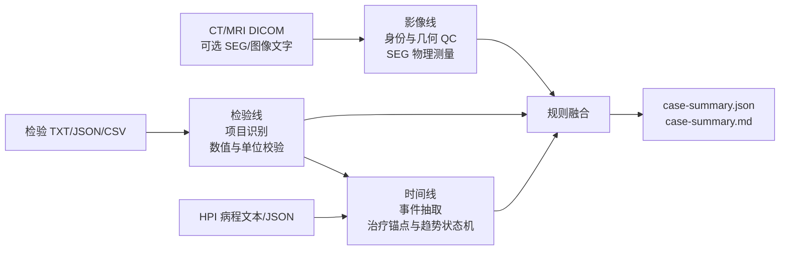

# OncoFuse：影像 × 检验的 Fail-Closed 证据融合

[English](README.md) | 中文

一个可审计的研究原型：把分割后的 3D 肝脏影像与纵向 AFP/DCP 检验证据做规则化融合——
当几何、单位、配对、配准或报告安全性无法验证时，**拒绝给出结论**（fail-closed）。

它不诊断 HCC，不输出 LI-RADS/BCLC/RECIST/mRECIST 分期，不预测预后，也不提供治疗建议。
每个输出都是带来源的、经 Pydantic 校验的 JSON 工件；每条结论都能追溯到规则 ID。

> **在线演示（合成数据）**：见 [`docs/demo/`](docs/demo/)，本地打开 `docs/demo/index.html`
> 即可，或在 GitHub 上启用 Pages（docs 目录）分享。所有数字均为合成并已标注。

## 为什么是这个项目

多数医疗 AI demo 回答"模型有多准"，本仓库回答另一个问题：

> 多模态管线能否逐个工件地证明"为什么这么说"——并在无法证明时保持沉默？

- 分割掩膜只做**确定性测量**（体素、体积、质心），从不交给语言模型"解读"。
- 纵向病灶用**匈牙利全局分配**配对，明确输出 匹配/新发/消失/分裂/融合/不确定 状态。
- AFP/DCP 趋势保留比较符（`<`、`>=`）、解析状态、参考区间和原始单位；不可用值保持 null，绝不静默补 0。
- **版本化 YAML 规则引擎**融合影像与检验证据，裁决带 reason codes、证据引用和阈值版本。
- LLM（即使启用）只负责把紧凑脱敏证据**渲染**成报告；改锁定字段、编造数字、漏质控、
  下诊断、做分期、给治疗建议或回显注入指令，都会**阻断**报告。确定性渲染器永远兜底。

## 30 秒上手

```powershell
python -m venv .venv
.\.venv\Scripts\python -m pip install -e ".[dev]"
.\.venv\Scripts\hcc-demo run-demo --output demo-output
```

预期裁决为 `concordant_progression_signal`（全合成数据的契约测试，非临床性能证据）。
基础安装不下载模型权重，不需要 CUDA。`.[ocr]`、`.[llm]` 和 `.[imaging-ai]` 是可选能力。

## 能力总览

| 能力 | 命令 | 状态 |
|---|---|---|
| LiON-inspired 单期 CT 多模态报告 | `hcc-demo run-report` | ✅ 1.2 输入合同 / fail-closed |
| 合成端到端 demo | `hcc-demo run-demo` | ✅ 稳定 |
| 纵向 NIfTI + 掩膜分析 | `hcc-demo analyze` | ✅ 稳定 |
| DICOM CT + SEG 转换（几何 QC） | `hcc-demo convert-dicom-seg` | ✅ 稳定 |
| TCIA HCC_003 公开演示 | `hcc-demo run-public-demo` | ✅ 稳定 |
| 三线病例管线（CT/MR + 检验 + HPI） | `hcc-demo analyze-case` | ✅ 0.4.0 |
| 受控 LLM 报告渲染 + 审计 | `hcc-demo run-deepseek` | ✅ fail-closed |
| 队列评估（bootstrap 区间） | `hcc-demo evaluate-cohort` | ✅ 研究用 |
| 锁定多中心验证工作流 | `hcc-demo validate-research-cohort` … | ✅ 研究用 |
| CPU patch 提取浏览器演示 | `hcc-demo vlm-skeleton-web` | ⚠️ **mock**，无模型 |
| VLM 任务 prompt（可审计 / 放开） | `hcc-demo vlm-prompt` | ✅ 双模式 |
| 双模式 VLM prompt 真实 LLM 对照（文本 LLM，可选 `--image` 附视觉输入；fail-closed 审计） | `hcc-demo vlm-live` | ✅ fail-closed |
| 本地可视化服务（上传影像+检验→解读） | `hcc-demo vlm-web` | ✅ 本地 |
| 真实 3D VLM 推理（M3D-LaMed） | — | 🗺️ Roadmap，见下 |

### LiON-inspired HCC 报告链

`run-report` 是当前推荐入口：现有 SEG 先形成像素级→病灶级→患者级定量证据；可选 GLM 只读取重新渲染的去标识化 PNG 并描述可见征象；规则层把影像交叉检查、标准化检验趋势和治疗锚点形成锁定裁决。`deepseek-r1-distill-qwen-32b` 只生成不含数字的可选中文辅助解读，不能修改正式 JSON；其他支持稳定 JSON 的 DeepSeek 模型仍可走受控结构化报告通道。

```powershell
hcc-demo run-report `
  --case-input examples\case_input.recommended.json `
  --output case-output `
  --glm-mode off `
  --report-mode deterministic
```

实时模式需要显式改为 `--glm-mode live --report-mode live`；加 `--require-live-models` 后，任一模型未实际成功或输出未通过审计都会返回非零退出码，同时保留降级审计。详见 [实施与运行手册](docs/LION_INSPIRED_HCC_PIPELINE_PLAN.md) 和 [病例输入规范](docs/CASE_INPUT_SPEC.md)。

## Roadmap

**真实 3D VLM 推理**已规划，详见 [docs/VLM_WEB_DEMO_PLAN.md](docs/VLM_WEB_DEMO_PLAN.md)：

- 本地 DICOM 去标识化 + 预处理为 `[1,32,256,256]` 张量
- 租用 GPU 仅推理运行 `M3D-LaMed-Phi-3-4B`（不训练）
- 两段式输出：纯影像英文观察 → 受控结构化提取；临床上下文不污染影像观察
- 零张量负控实验证明（或诚实报告不存在）图像条件化
- Mock 演示与真实推理严格分离；失败绝不回退到 mock 输出

仓库中的 connector/训练模块（`vlm_model`、`vlm_training`、`multimodal_connector`、
`visual_tokens`）属于**实验性代码**，不在可信演示路径上。

## 双模式 VLM prompt

未来 VLM 入口（`vlm_prompting.build_vlm_task_prompt`）支持两种融合模式：

- **可审计（默认）**：prompt 只含影像 token 与影像元数据。检验与 HPI 上下文按设计
  隔离；趋势由 `labs.py` 确定性计算，在规则引擎层融合。prompt 元数据记录被隔离的
  内容（`labs_present_but_withheld`）。
- **放开**：检验观测以 `[UNVERIFIED_CONTEXT]` + `[LAB_###]` 形式注入，携带日期、
  数值、单位、参考状态、趋势与来源引用；prompt 强制逐字照抄并引用证据 ID，禁止
  重算、取整或外推。该链路仅用于并排演示数字幻觉 / 先验偏倚，不进入可信路径。

```powershell
hcc-demo parse-labs --input examples\lab_report.synthetic.txt --patient-id DEMO --output labs.json
hcc-demo vlm-prompt --labs labs.json --fusion-mode both --phase portal_venous --timepoint followup --output prompt-out
```

输出 `vlm_prompt_auditable.{json,txt}` 与 `vlm_prompt_open.{json,txt}`。
浏览器演示（[`docs/demo/index.html`](docs/demo/index.html)）将两种输出并排展示、
高亮差异，并在放开链路标注「不可审计」。

### 真实 LLM 对照（`vlm-live`）

`hcc-demo vlm-live` 将双臂 prompt 发往配置的 OpenAI 兼容端点
（`LLM_API_KEY` / `LLM_BASE_URL` / `LLM_MODEL_NAME`），按 `VlmDemoReport`
校验输出，为每个数字附加可追溯的 `numeric_citations`（解析自注入的
`[LAB_###]` 项），任何无法追溯到所给上下文的数字都会阻断报告：

```powershell
hcc-demo vlm-live --labs labs.json --fusion-mode both --output live-out --temperature 0.3 --no-json-object
```

注意：

- 加 `--image <png>` 附加真实视觉输入（GLM-4V 等）；加 `--imaging-evidence <json>`
  把确定性影像测量（体积、病灶数）注入 prompt。
- 推理类模型（如 `deepseek-r1-distill-qwen-32b`）在 `response_format=json_object`
  下可能返回空正文；此时加 `--no-json-object --temperature 0.3`。受控提取优先使用
  非推理模型，见 [docs/VLM_WEB_DEMO_PLAN.md](docs/VLM_WEB_DEMO_PLAN.md)。
- 产物：`vlm_prompt_{mode}.json`、`vlm_arm_{mode}.json`（原始响应 + 审计）、
  `dual_arm_comparison.json`（语句差异、数字引用、幻觉候选），以及
  `web_demo.json`——自包含载荷，`docs/demo/index.html` 可直接载入（"载入真实结果"）
  替换静态 mock 面板为真实双臂输出。
- LLM 缺失/异常/被拦截时绝不产出报告：确定性模板渲染所给上下文，且必须通过同一校验器。

### 本地可视化服务（`vlm-web`）

`hcc-demo vlm-web` 提供真实输入入口：上传 CT 体数据（`.nii.gz`）+ 肿瘤 mask
（`.nii.gz`）+ 检验报告（`.txt` / `ClinicalLabEvidence` JSON），页面返回可审计解读。
服务端确定性测量影像、运行 auditable 臂（影像-only VLM）、计算检验趋势，任何审计
失败即拦截。页面展示的是**给医生看的临床报告**，而不是工程术语：

```powershell
hcc-demo vlm-web --port 7861
```

上传后页面包含：

- **临床报告（供医师参考 · 非诊断）**——影像所见、检验所见、综合评估与建议，
  全部为临床语言；规则引擎术语与审计轨迹折叠进「技术附录」。
- **可滚动轴向切片浏览**（16 张，滑块 + 上一张/下一张，肿瘤 mask 叠加）与病灶放大图；
  切片统一重定向到 RAS 标准坐标系，并按放射学方位显示（前腹壁在上、患者右侧在图像左侧）。
- **检验趋势图**（含参考上限虚线、各标志物变化百分比）与时间线（CT 日期与各检验日期对齐）。
- **纵向影像对比**（可选第二时间点）：上传随访 CT + mask 后，报告新增体积变化、
  新发病灶与进展/缓解/稳定判断，并与检验趋势联合评估；切片浏览支持基线/随访切换。
- **GALAD 评分**：填写年龄与性别后，报告包含由 AFP、AFP-L3%、DCP、年龄、性别
  计算的 GALAD 评分与风险分层（LOW/INTERMEDIATE/HIGH）——明确非诊断。
- **风险等级徽章**（高/中/低），由指南式启发（病灶大小 × 标志物阈值）派生——明确非诊断。
- **分级审计**：确诊断言（如“确诊 HCC”）仍拦截；软性表述（如“consistent with…”）
  放行但显示「需医师确认」警告。
- **服务健康检查**（`GET /api/health`）与页面顶部版本徽章（`vlm-web 0.4.0-web · 启动时间`），
  一眼识别服务/页面是否过期；直接打开文件时会提示「请先启动服务」，不再裸报 fetch 错误。

浏览器打开 `http://127.0.0.1:7861/`。服务仅绑定本机、LLM key 只存在服务端环境变量；
这是本地工具而非 GitHub Pages 托管应用。勾选「同时跑 open 对照臂」可在同一上传上
渲染双模式对比。

## 三条证据线



- 影像线：检查 PatientID、UID、方向、位置、spacing、切片顺序和 PHI。有专家 SEG 时计算病灶体积、质心和三维最大范围；没有 SEG 时只保留已有图像工具的定性观察。
- 检验线：支持 AFP、DCP/PIVKA-II、AFP-L3%、肝储备、肝损伤和病毒学项目，保留比较符、单位、参考范围、原文和 span。解析失败、未知单位和缺失值不会被补成 0。
- HPI 线：按真实日期合并治疗、检验和影像事件，识别持续上升、治疗后下降、最低点后反弹等确定性状态。

## 一步式分析

```powershell
python examples\generate_dicom_seg_fixture.py --output synthetic-case
.\.venv\Scripts\hcc-demo analyze-case `
  --dicom-dir synthetic-case\study `
  --seg synthetic-case\seg.dcm `
  --image-evidence examples\image_evidence.synthetic.json `
  --labs examples\lab_report.synthetic.txt `
  --hpi examples\hpi.synthetic.txt `
  --patient-id RESEARCH_001 `
  --output case-output
```

`--seg`、`--image-evidence` 和 `--hpi` 可省略。若 SEG 和结构化影像文字都缺失，影像线输出 `unavailable`；若 HPI 缺失，当前影像和检验仍会分析，但时间趋势标记为不完整。

## 分阶段调试

```powershell
.\.venv\Scripts\hcc-demo parse-imaging --dicom-dir study --patient-id RESEARCH_001 --output imaging.json
.\.venv\Scripts\hcc-demo parse-labs --input examples\lab_report.synthetic.txt --patient-id RESEARCH_001 --output labs.json
.\.venv\Scripts\hcc-demo parse-hpi --input examples\hpi.synthetic.txt --patient-id RESEARCH_001 --labs labs.json --imaging imaging.json --output timeline.json
.\.venv\Scripts\hcc-demo summarize-case --imaging imaging.json --labs labs.json --timeline timeline.json --output case-output
```

详细数据流见 [三线架构说明](docs/THREE_LINE_PIPELINE.md)。真实队列锁定验证仍可使用原有 cohort CLI，见 [真实队列验证说明](docs/REAL_COHORT_VALIDATION.md)。数据与模型权利边界分别见 [DATA_SOURCES.md](DATA_SOURCES.md) 和 [MODEL_SOURCES.md](MODEL_SOURCES.md)。
