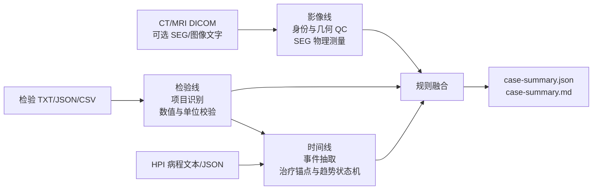

# HCC 多模态研究证据工具

[English](README.md) | 中文

这是一个适合普通 CPU 电脑离线运行、可审计、可上传 GitHub 的 HCC 研究原型。它接收一次 CT/MRI DICOM 检查、可选 DICOM SEG、已有图像转文字结果、检验报告和可选病程文本，输出结构化 JSON 与 Markdown 研究证据摘要。

它不诊断 HCC，不输出 LI-RADS/BCLC/RECIST/mRECIST 分期，不预测预后，也不提供治疗建议。

## 三条证据线



- 影像线：检查 PatientID、UID、方向、位置、spacing、切片顺序和 PHI。有专家 SEG 时计算病灶体积、质心和三维最大范围；没有 SEG 时只保留已有图像工具的定性观察。
- 检验线：支持 AFP、DCP/PIVKA-II、AFP-L3%、肝储备、肝损伤和病毒学项目，保留比较符、单位、参考范围、原文和 span。解析失败、未知单位和缺失值不会被补成 0。
- HPI 线：按真实日期合并治疗、检验和影像事件，识别持续上升、治疗后下降、最低点后反弹等确定性状态。

## 安装

```powershell
python -m venv .venv
.\.venv\Scripts\python -m pip install -e ".[dev]"
.\.venv\Scripts\python -m pytest --cov=hcc_multimodal -q
```

基础安装不下载模型权重，不需要 CUDA。`.[ocr]`、`.[llm]` 和 `.[imaging-ai]` 是后续或可选能力；首版主流程不依赖它们。

## 一步式分析

```powershell
python examples\generate_dicom_seg_fixture.py --output synthetic-case
.\.venv\Scripts\hcc-demo analyze-case `
  --dicom-dir synthetic-case\study `
  --seg synthetic-case\seg.dcm `
  --image-evidence examples\image_evidence.synthetic.json `
  --labs examples\lab_report.synthetic.txt `
  --hpi examples\hpi.synthetic.txt `
  --patient-id RESEARCH_001 `
  --output case-output
```

`--seg`、`--image-evidence` 和 `--hpi` 可省略。若 SEG 和结构化影像文字都缺失，影像线输出 `unavailable`；若 HPI 缺失，当前影像和检验仍会分析，但时间趋势标记为不完整。

## 分阶段调试

```powershell
.\.venv\Scripts\hcc-demo parse-imaging --dicom-dir study --patient-id RESEARCH_001 --output imaging.json
.\.venv\Scripts\hcc-demo parse-labs --input examples\lab_report.synthetic.txt --patient-id RESEARCH_001 --output labs.json
.\.venv\Scripts\hcc-demo parse-hpi --input examples\hpi.synthetic.txt --patient-id RESEARCH_001 --labs labs.json --imaging imaging.json --output timeline.json
.\.venv\Scripts\hcc-demo summarize-case --imaging imaging.json --labs labs.json --timeline timeline.json --output case-output
```

详细数据流见 [三线架构说明](docs/THREE_LINE_PIPELINE.md)。真实队列锁定验证仍可使用原有 cohort CLI，见 [真实队列验证说明](docs/REAL_COHORT_VALIDATION.md)。数据与模型权利边界分别见 [DATA_SOURCES.md](DATA_SOURCES.md) 和 [MODEL_SOURCES.md](MODEL_SOURCES.md)。
