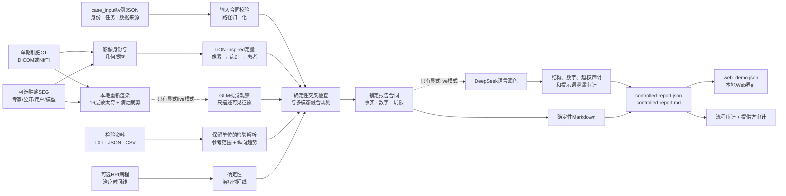
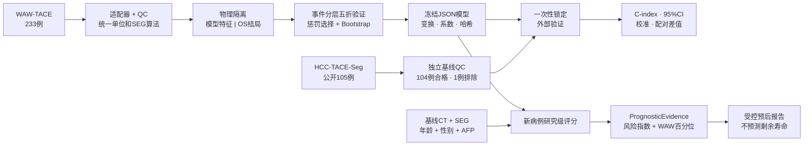

# OncoFuse

### 可审计的HCC多模态证据、外部验证与受控报告系统

[English](README.md) · 简体中文

[](https://github.com/xhu014183-cmd/OncoFuse/actions/workflows/ci.yml)
[](https://www.python.org/)
[](tests/)
[](pyproject.toml)
[](docs/RELEASE_v0.4.0.md)
[](LICENSE)

**OncoFuse把肝脏CT、肿瘤分割、检验指标和临床背景，转换成可追溯的定量证据、
研究级生存风险证据，以及事实被锁定的人类可读报告。**

仓库包含两条互相关联、但科学问题不同的完整链路：

| 链路 | 输入 | 核心处理 | 最终输出 |
|---|---|---|---|
| 单病例多模态证据报告 | CT、可选肿瘤SEG、纵向检验、可选HPI | 几何质控、LiON-inspired病灶测量、可选GLM观察、确定性证据融合 | 可审计JSON、中文Markdown报告和Web载荷 |
| 公开队列预后研究 | WAW-TACE开发队列、HCC-TACE-Seg外部队列 | 防结局泄漏的Cox建模和一次性外部验证 | 冻结JSON模型、指标、置信区间、图表和模型卡 |

> **仅限研究用途。** OncoFuse不是医疗器械，不能诊断HCC，不能自动给出
> LI-RADS/BCLC/RECIST/mRECIST结论，不能预测个体还能生存多少个月，也不能给出
> 治疗建议。当前流程依赖已有参考SEG，尚未经过前瞻性临床验证。

## 一、单病例报告：从输入到输出的完整链路

系统不是把所有原始资料直接扔给一个大语言模型。每类输入先转化成经过验证、可以
追溯的证据对象；确定性规则负责判断证据关系；所有事实锁定后，DeepSeek才可以润色
语言。因此，最终结论不取决于大模型“写得像不像医生”。



### 每一步具体做什么

| 阶段 | 接收什么 | 产出什么 | 失败时怎么办 |
|---|---|---|---|
| 病例输入合同 | 带版本的JSON和文件引用 | 归一化病例身份、任务和数据关系 | 版本错误、路径歧义、非法组合直接拒绝 |
| 影像质控 | CT和可选SEG | 方向、层距、形状、空间对齐和来源检查 | 掩膜错位、空掩膜不能产生可信病灶数值 |
| LiON-inspired适配层 | 通过几何校验的CT/SEG | 掩膜哈希；病灶ID、体积、三维径、质心；患者总肿瘤负荷 | 没有SEG只表示**无法测量**，绝不写成“零病灶” |
| GLM视觉观察器 | 仅接收重绘匿名PNG和匿名病灶ID | 结构化可见征象、不确定性、图片引用、调用审计 | 诊断断言、未知病灶ID、虚构数字、额外字段或API失败都会被阻断 |
| 检验/HPI处理 | 基线及纵向检验、可选临床病程 | 统一单位、参考范围、变化趋势、肝储备证据和治疗锚点 | 不支持单位和缺失数据原样保留为不确定性 |
| 交叉检查与规则层 | 经过验证的影像、GLM、检验、HPI和来源 | 支持/冲突/缺失证据、原因码和人工复核标志 | 不把GLM与SEG算成两个独立模态，也不平均概率 |
| 报告锁定 | 确定性裁决与审计证据 | 数字、列表、状态、局限和声明不可被改写的`ControlledReport` | 合同校验不通过就拒绝报告 |
| DeepSeek | 仅接收压缩后的锁定内容 | 可选的、更自然的中文叙述 | 不能修改证据和数字；失败时使用确定性报告并标记降级 |

### 输入长什么样

推荐使用`case_input 1.2`。JSON只引用磁盘上的数据，不把原始影像塞进JSON。

```json
{
  "schema_version": "1.2.0",
  "case_id": "CASE_001",
  "patient_id": "RESEARCH_001",
  "clinical_task": "recurrence_surveillance",
  "index_date": "2026-07-20",
  "data_relationship": {
    "imaging_origin": "real_public",
    "laboratory_origin": "synthetic",
    "pairing_status": "unpaired_poc_composite",
    "statement": "公开影像与合成检验仅组合用于软件演示"
  },
  "imaging": {
    "source_type": "nifti",
    "nifti_image": "ct.nii.gz",
    "dicom_dir": null,
    "seg": "tumor_mask.nii.gz",
    "seg_role": "public_reference",
    "study_date": "2026-07-20",
    "phase": "portal_venous"
  },
  "laboratory": {
    "source_type": "file",
    "file_path": "labs.txt"
  },
  "hpi": {
    "source_type": "file",
    "file_path": "hpi.txt"
  }
}
```

关键规则：

- DICOM必须提供`dicom_dir`，NIfTI必须提供`nifti_image`，二者互斥。
- 第一版LiON-inspired链只接受一次CT检查和一个期相；单期CT不能评价完整动态强化。
- 单病例证据报告可以没有SEG，但没有SEG时不输出病灶数和肿瘤负荷。
- “公开影像＋编造检验”必须标记为`unpaired_poc_composite`，报告永久展示未配对限制。
- GLM永远看不到检验值、HPI、OS结局和模型风险分数。

完整字段见[病例输入规范](docs/CASE_INPUT_SPEC.md)和
[推荐输入样例](examples/case_input.recommended.json)。

### 最后会输出什么

执行一次`run-report`不仅保存最终文章，也保存每一步如何得到它：

```text
case-output/
├── case-input.normalized.json       # 解析后的版本化输入
├── imaging-input-qc.json            # CT/SEG几何和来源质控
├── lion-inspired-evidence.json      # 像素、病灶、患者三级定量证据
├── glm-imaging-evidence.json        # 通过校验的可见征象，或不可用状态
├── imaging-crosscheck.json          # 病灶覆盖和结构冲突检查
├── clinical-lab-evidence.json       # 标准化检验和纵向趋势
├── clinical-verdict.json            # 确定性融合结果和规则轨迹
├── deepseek-prompt.json             # 压缩后的结构化报告请求
├── deepseek-narrative-prompt.json   # 可选的纯叙述润色请求
├── deepseek-narrative.json          # 接受的文字，或被阻断/不可用状态
├── controlled-report.json           # 权威机器可读报告
├── controlled-report.md             # 最终人类可读报告
├── web_demo.json                    # 本地Web页面使用的数据
├── pipeline-audit.json              # 模式、耗时、降级和产物索引
└── provider-audit/
    ├── glm.json                     # 提供方、模型和状态，不记录密钥
    └── deepseek.json
```

权威报告固定包含：影像摘要、检验摘要、多模态评估、支持证据、冲突证据、缺失证据、
不确定性、数据质量、是否需要人工复核、研究用途和固定免责声明。

## 二、公开队列预后研究：从数据到外部验证

这条链回答的是另一个问题：对于已经确诊HCC、接受首次TACE的患者，治疗前的临床
信息和肿瘤负荷能否排序OS风险？它不是HCC诊断模型。



### 预先规定的输入和模型

| 模型 | 治疗前输入特征 |
|---|---|
| `clinical_core` | 年龄、性别、`log1p(AFP ng/mL)` |
| `imaging_core` | 26连通域病灶数、总体积、最大三维径、最大病灶球形度 |
| `fused_core` | 上述7个临床和影像特征 |
| `fused_extended` | 仅在WAW内部探索肝功能指标，不作外部验证声明 |

死亡状态和生存时间与模型特征物理隔离。治疗后疗效、进展、随访数值和TACE次数禁止
作为输入，也不会发给GLM或DeepSeek。两个队列都用同一套低维SEG算法重新计算特征，
不混用来源不同的高维radiomics。

### 外部验证结果

| 模型 | WAW内部嵌套折外C-index（95% CI） | HCC-TACE-Seg外部C-index（95% CI） |
|---|---:|---:|
| 临床模型 | 0.5917（0.5484–0.6373） | 0.5860（0.5065–0.6579） |
| 影像模型 | 0.6047（0.5583–0.6490） | 0.5467（0.4746–0.6094） |
| 融合模型 | **0.6310**（0.5830–0.6725） | 0.5819（0.5131–0.6516） |

外部评估包括104例、92个死亡事件。另1例因基线CT缺层/层距不均，在模型评估前
排除；系统没有插值补层。

- 融合模型减临床模型：**−0.0041**（95% CI −0.0766～0.0671）
- 融合模型减影像模型：**0.0352**（95% CI 0.0029～0.0691）

当前4个形态学影像特征**没有**在外部队列中改善年龄、性别和AFP的区分能力。外部
校准存在队列漂移，比例风险筛查也对部分变量发出警告。看到外部结果后没有重新选特征、
调阈值或再校准。这一诚实的阴性增量结果也是项目成果的一部分。

### 研究链会留下哪些产物

```text
cohort/
├── dataset-manifest.json
├── cohort-qc.json
├── development-features.csv         # 只含模型特征
├── development-endpoints.csv        # 只含OS标签
├── external-test-features.csv
├── external-test-endpoints.csv
├── exclusion-manifest.json
└── source-unit-audit.json

models/
├── split-manifest.json
├── model-bundle-clinical.json
├── model-bundle-imaging.json
├── model-bundle-fused.json
├── internal-validation.json
└── model-card.md

external/
├── external-unlock-audit.json
├── external-validation.json
├── model-comparison.json
└── figures/

prognosis-output/
├── case-input.normalized.json
├── lion-inspired-evidence.json
├── glm-imaging-evidence.json
├── prognostic-evidence.json
├── controlled-prognosis-report.json
├── controlled-prognosis-report.md
├── deepseek-narrative.json
├── pipeline-audit.json
└── provider-audit/
```

模型包是透明JSON，保存特征顺序、拟合后的变换参数、系数、基线风险、开发集风险分布、
验证状态、队列版本和哈希，不依赖不可检查的Pickle文件。

## 三、各组件究竟负责什么

| 组件 | 负责的工作 | 明确禁止的工作 |
|---|---|---|
| 参考SEG＋测量代码 | 可复现的病灶几何和肿瘤负荷 | 自动诊断、恶性概率或伪造分割 |
| LiON-inspired适配层 | 建立像素→病灶→患者三级证据合同 | 声称复现未公开的临床LiON系统 |
| GLM视觉模型 | 描述重新渲染图片里的可见征象 | 查看AFP/OS/风险；诊断、分期、治疗建议或编造数值 |
| 确定性规则 | 判断证据状态、冲突、缺失和是否需复核 | 隐藏不确定性，或把模型一致当作独立确认 |
| 冻结Cox模型 | 计算相对风险指数和开发队列百分位 | 诊断HCC或预测还能生存多少个月 |
| DeepSeek | 在证据锁定后改善中文表达 | 决定裁决，或修改事实、数字、模型身份和局限 |

一句话概括：**测量代码提供定量证据，GLM提供受限制的影像观察，确定性规则负责融合，
冻结Cox模型计算研究级风险，DeepSeek只负责语言润色。**

## 四、如何运行

### 安装

```powershell
git clone https://github.com/xhu014183-cmd/OncoFuse.git
cd OncoFuse
python -m venv .venv
.\.venv\Scripts\Activate.ps1
python -m pip install --upgrade pip
pip install -e ".[dev,research]"
```

支持Python 3.11和3.12。离线流程不需要GPU，也不需要API密钥。

### 完全合成的离线检查

```powershell
hcc-demo run-demo --output demo-output
```

它验证输入合同和编排能否完整运行，不代表临床性能。

### 运行单病例离线报告

替换样例中的影像路径后执行：

```powershell
hcc-demo run-report `
  --case-input examples\case_input.recommended.json `
  --output case-output `
  --glm-mode off `
  --report-mode deterministic
```

### 显式启用GLM和DeepSeek

密钥只能放在本机环境变量中，不能写入Git：

```powershell
$env:ZHIPU_API_KEY = "<仅在本机设置>"
$env:ZHIPU_BASE_URL = "https://open.bigmodel.cn/api/paas/v4"
$env:ZHIPU_VISION_MODEL = "glm-4.6v-flash"

$env:DEEPSEEK_API_KEY = "<仅在本机设置>"
$env:DEEPSEEK_BASE_URL = "<OpenAI兼容服务地址>"
$env:DEEPSEEK_MODEL = "<已经配置的模型>"

hcc-demo run-report `
  --case-input examples\case_input.recommended.json `
  --output case-output-live `
  --glm-mode live `
  --report-mode live `
  --require-live-models
```

GLM只收到本地重绘、去标识化的PNG；原始DICOM、文件路径、患者编号、检验和结局不会
外发。DeepSeek只收到压缩后的锁定证据，不接收CT像素或掩膜。API失败时系统输出明确的
降级审计，并保留完整确定性报告。

### 使用冻结模型生成单病例预后报告

```powershell
hcc-demo run-prognosis-report `
  --case-input examples\prognosis_case_input.json `
  --model research-output\models\model-bundle-fused.json `
  --output prognosis-output `
  --glm-mode off `
  --report-mode deterministic
```

### 从公开数据复现预后研究

```powershell
pip install -e ".[dev,public-data,research]"

$researchDataRoot = "E:\hcc-public-data"
$researchOutputRoot = "E:\hcc-research-output"

hcc-demo sync-prognosis-data --dataset waw-tace `
  --tier metadata --data-root $researchDataRoot --accept-license

hcc-demo sync-prognosis-data --dataset hcc-tace-seg `
  --tier pilot --data-root $researchDataRoot --accept-license

hcc-demo build-prognosis-cohort `
  --data-root $researchDataRoot `
  --output "$researchOutputRoot\cohort"

hcc-demo train-prognosis-model `
  --cohort "$researchOutputRoot\cohort\development-cohort.json" `
  --output "$researchOutputRoot\models" `
  --seed 1729 --bootstrap-iterations 1000

# 在这里检查QC、排除清单、折叠名单、内部结果和冻结模型哈希。
# 确认模型冻结后，才能准备完整外部队列：
hcc-demo sync-prognosis-data --dataset hcc-tace-seg `
  --tier full --data-root $researchDataRoot --accept-license

hcc-demo build-prognosis-cohort `
  --data-root $researchDataRoot `
  --output "$researchOutputRoot\cohort-frozen"

hcc-demo evaluate-prognosis-model `
  --cohort "$researchOutputRoot\cohort-frozen\external-test-cohort.json" `
  --models "$researchOutputRoot\models" `
  --output "$researchOutputRoot\external" `
  --unlock-external --seed 1729 --bootstrap-iterations 1000
```

打开外部队列前，应先检查数据许可、QC、排除清单、折叠名单、内部结果和冻结模型哈希。
完整步骤见[从空目录复现指南](docs/HCC_PUBLIC_OS_REPRODUCIBILITY.md)。原始数据和生成的
研究结果已被Git忽略，应保存在仓库外部。

### 启动本地Web界面

```powershell
hcc-demo vlm-web --port 7861
```

浏览器打开`http://127.0.0.1:7861/`。页面提供CT切片与SEG叠加、检验趋势、治疗时间线、
LiON-inspired证据、影像交叉检查、受控报告和提供方审计。

- `POST /api/interpret`：单病例证据报告链
- `POST /api/prognosis`：冻结模型预后报告链
- `GET /api/health`：仅显示配置是否存在和模型名，不显示密钥

## 五、质量验证

```powershell
python -m ruff check src tests
python -m mypy src/hcc_multimodal
python -m pytest --cov=hcc_multimodal --cov-report=term-missing -q
```

当前GitHub Actions在Python 3.11和3.12上的基线均为：**260 passed、11 skipped、
覆盖率75.79%**。测试覆盖影像几何、空/错位SEG、单位换算、结局泄漏、确定性队列切分、
模型序列化、外部测试隔离、GLM载荷隐私、DeepSeek锁定字段、CLI/Web一致性和提供方降级。

## 六、文档与公开数据

| 资料 | 用途 |
|---|---|
| [HCC公开OS研究方案](docs/HCC_PUBLIC_OS_PROTOCOL.md) | 预先规定队列、终点、特征和统计方法 |
| [复现指南](docs/HCC_PUBLIC_OS_REPRODUCIBILITY.md) | 从空数据目录和输出目录执行的命令 |
| [模型卡](docs/HCC_PUBLIC_OS_MODEL_CARD.md) | 用途、结果、局限和禁止声明 |
| [数据卡](docs/HCC_PUBLIC_OS_DATA_CARD.md) | 数据集范围、许可、字段和排除 |
| [实验日志](docs/HCC_PUBLIC_OS_EXPERIMENT_LOG.md) | 成功与不理想结果的记录 |
| [LiON-inspired计划](docs/LION_INSPIRED_HCC_PIPELINE_PLAN.md) | 证据和报告设计决策 |
| [病例输入规范](docs/CASE_INPUT_SPEC.md) | 带版本的单病例输入合同 |
| [三线证据流程](docs/THREE_LINE_PIPELINE.md) | 影像、检验和HPI编排 |
| [数据来源](DATA_SOURCES.md) | 公开数据来源和治理 |
| [模型来源](MODEL_SOURCES.md) | 外部模型来源和权限边界 |

公开来源：

- [WAW-TACE](https://zenodo.org/records/12741586)：开发队列，233例
- [HCC-TACE-Seg](https://www.cancerimagingarchive.net/collection/hcc-tace-seg/)：
  锁定外部队列，105例
- [LiON论文](https://www.nature.com/articles/s41591-026-04589-y)：肝脏分层证据思想来源
- [公开PLAN框架](https://github.com/alibaba-damo-academy/pixel-lesion-patient-network)：
  未来可替换后端参考，当前未集成、未运行

使用者必须自行阅读并接受各数据源许可。本仓库不重新分发原始公开影像、患者级源数据表、
模型权重或API密钥。

## 仓库结构

```text
src/hcc_multimodal/   合同、QC、测量、建模、报告、CLI和Web服务
tests/                 几何、泄漏、模型、大模型安全和API测试
examples/              合成输入和版本化病例模板
docs/                  研究方案、模型卡、数据卡、复现指南和本地演示
schemas/               导出的公共JSON Schema
```

## 许可证

源代码使用[MIT许可证](LICENSE)。公开数据集和外部模型仍受各自许可与署名要求约束。
