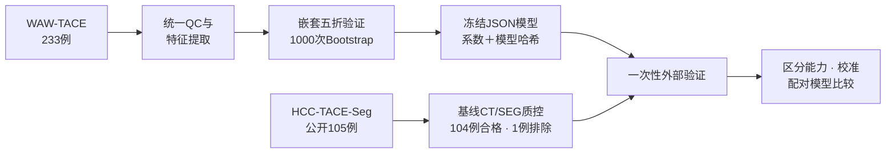
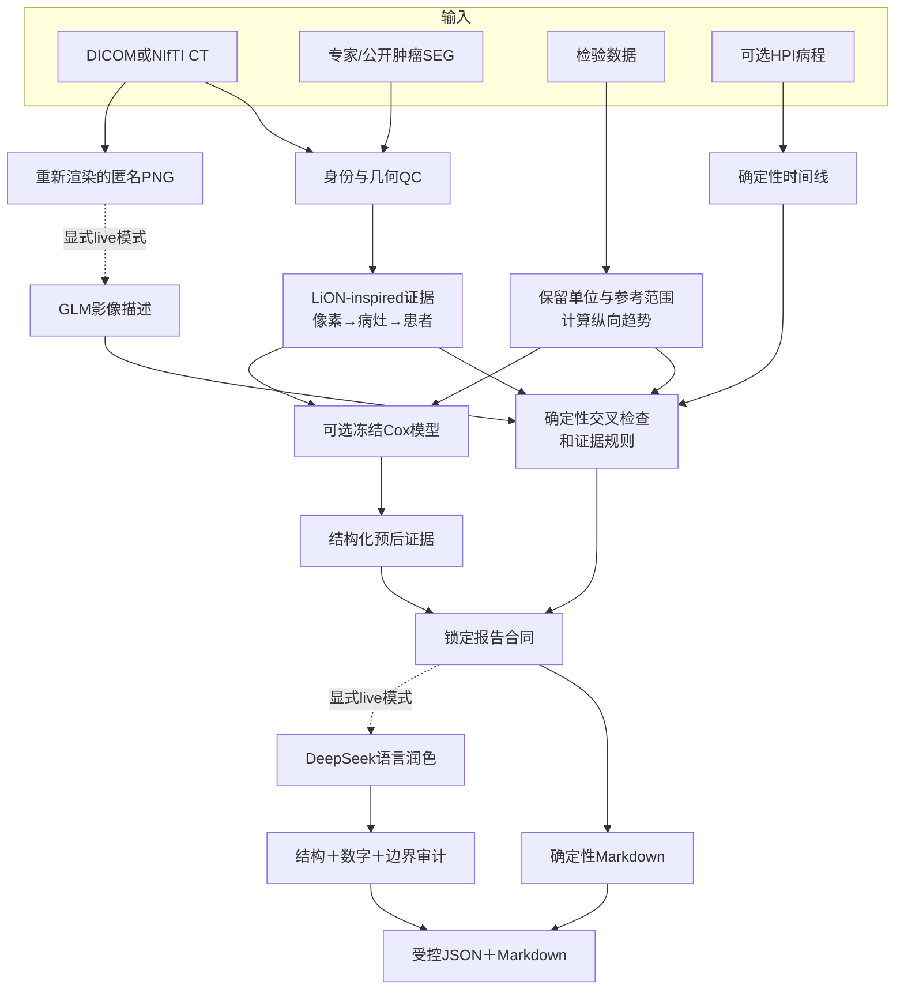

# OncoFuse

### 面向肝细胞癌的可审计多模态证据与生存风险研究平台

[English](README.md) · 简体中文

[](https://github.com/xhu014183-cmd/OncoFuse/actions/workflows/ci.yml)
[](https://www.python.org/)
[](tests/)
[](pyproject.toml)
[](docs/RELEASE_v0.4.0.md)
[](LICENSE)

**OncoFuse是一个研究级平台：把三维肝脏CT、专家肿瘤SEG、检验指标和临床背景，
转换成可追溯证据、冻结的生存风险模型和受控报告。** 系统采用fail-closed原则：
当影像几何、单位、患者配对、模型输出或数据来源无法验证时，明确警告或拒绝，
而不是编造一个看似完整的临床结论。

> **重要声明：**本仓库不是医疗器械，不能替代放射科医生，不能用于HCC诊断，
> 不能自动给出LI-RADS/BCLC/RECIST/mRECIST结论，不能预测个体剩余生存时间，
> 也不能提供治疗建议。

---

## 为什么做这个项目

很多医疗AI项目止步于一个分数或一份流畅报告。OncoFuse把完整证据链当作核心成果：

1. **先测量，再解释。** CT与SEG必须先通过患者坐标系几何检查，才能计算病灶数值。
2. **输入与答案隔离。** 生存结局不会进入特征表、GLM提示词、DeepSeek提示词或单病例推理。
3. **外部验证前冻结。** 预处理、特征顺序、模型系数、阈值和哈希全部提前锁定。
4. **限制大模型权限。** GLM只能描述重新渲染的去标识化图片；DeepSeek只能润色锁定证据。
5. **保留不理想结果。** 当前影像特征没有在外部队列中改善临床基线，这一结果被完整保留。

## 两条互相独立的研究链

| 研究链 | 回答的问题 | 输入 | 输出 |
|---|---|---|---|
| LiON-inspired单病例证据链 | 这个病例中有哪些可量化、可观察证据？ | 单期CT、可选专家/公开SEG、检验、可选HPI | 像素→病灶→患者证据、交叉检查、受控报告 |
| HCC-TACE公开队列预后研究 | 已确诊HCC患者接受TACE后，基线证据能否排序OS风险？ | 年龄、性别、AFP、统一CT/SEG形态特征 | 冻结Cox模型与独立外部验证 |

第一条链借鉴LiON的分层证据思想，但**不是LiON复现**。第二条链研究的是已经确诊
HCC患者的相对预后风险，**不是HCC诊断分类器**。

## 正式公开队列研究



### 预先指定的模型

- `clinical_core`：年龄、性别、`log1p(AFP)`
- `imaging_core`：病灶数、总体积、最大三维包围盒范围、最大病灶球形度
- `fused_core`：以上7个特征
- `fused_extended`：只在WAW内部探索的肝功能扩展模型，不作外部验证声明

主模型在两个队列中使用完全相同的低维SEG算法，不使用两套数据各自不同的高维
radiomics，也不使用治疗后疗效、进展、TACE次数或随访信息。

### 正式结果

| 模型 | WAW内部嵌套折外C-index（95% CI） | HCC-TACE-Seg外部C-index（95% CI） |
|---|---:|---:|
| 临床模型 | 0.5917（0.5484–0.6373） | 0.5860（0.5065–0.6579） |
| 影像模型 | 0.6047（0.5583–0.6490） | 0.5467（0.4746–0.6094） |
| 融合模型 | **0.6310**（0.5830–0.6725） | 0.5819（0.5131–0.6516） |

外部验证共**104例、92个死亡事件**。另1例因基线CT缺层/层距不均，在模型评估前
被排除；系统没有进行插值。

- 融合减临床：**−0.0041**（95% CI −0.0766～0.0671）
- 融合减影像：**0.0352**（95% CI 0.0029～0.0691）

**结果解释：**当前4个低维影像特征没有在外部队列中为年龄、性别和AFP带来额外
区分能力。外部校准存在队列漂移，比例风险筛查也对部分年龄、性别或病灶数变量发出
警告。系统没有根据外部结果重新调参。

这是一项诚实的阴性增量结果，不代表模型具有临床价值。项目贡献在于可复现、无结局
泄漏的外部验证流程，以及所有失败和限制均可追溯。

详细材料：[预注册方案](docs/HCC_PUBLIC_OS_PROTOCOL.md) ·
[实验日志](docs/HCC_PUBLIC_OS_EXPERIMENT_LOG.md) ·
[数据卡](docs/HCC_PUBLIC_OS_DATA_CARD.md) ·
[双语模型卡](docs/HCC_PUBLIC_OS_MODEL_CARD.md)

## 系统架构



### 各组件的权限边界

| 组件 | 可以做 | 绝不能做 |
|---|---|---|
| SEG测量 | 经过几何验证后计算病灶 | 输出诊断概率或伪造分割 |
| GLM视觉模型 | 描述重新渲染图片中的可见征象 | 接收AFP、结局、风险分数、DICOM元数据或患者标识 |
| Cox模型 | 输出冻结的相对风险证据 | 诊断HCC或预测剩余月数 |
| DeepSeek | 围绕锁定证据改善中文表达 | 修改数字、证据列表、模型身份、限制或临床裁决 |

外部模型默认关闭。调用失败时系统保留完整确定性报告，并明确记录降级状态，绝不会
把模板结果伪装成“大模型分析成功”。

## 快速开始

### 1. 安装

```powershell
git clone https://github.com/xhu014183-cmd/OncoFuse.git
cd OncoFuse
python -m venv .venv
.\.venv\Scripts\Activate.ps1
python -m pip install --upgrade pip
pip install -e ".[dev,research]"
```

支持Python 3.11和3.12。确定性演示不需要GPU或API密钥。

### 2. 运行完全合成、离线的端到端演示

```powershell
hcc-demo run-demo --output demo-output
```

预期研究裁决为`concordant_progression_signal`。这是合成数据契约测试，不是临床性能证据。

### 3. 运行质量检查

```powershell
python -m ruff check .
python -m mypy src
python -m pytest -q --cov=hcc_multimodal --cov-branch
```

当前验证基线：**268 passed、3 skipped、分支覆盖率76.31%**。

## 运行LiON-inspired单病例报告

先修改示例病例中的影像和SEG路径，再运行离线链：

```powershell
hcc-demo run-report `
  --case-input examples\case_input.recommended.json `
  --output case-output `
  --glm-mode off `
  --report-mode deterministic
```

报告统一标记为`LiON-inspired / precomputed-mask`。缺少SEG只表示“无法定量”，不能被
解释为“没有病灶”。单期CT也不能评价完整的动态强化模式。

## 复现公开队列预后研究

下载前必须自行阅读并接受两个公开数据集的许可：

```powershell
pip install -e ".[dev,public-data,research]"

$researchDataRoot = "E:\hcc-public-data"
$researchOutputRoot = "E:\hcc-research-output"

hcc-demo sync-prognosis-data --dataset waw-tace `
  --tier metadata --data-root $researchDataRoot --accept-license

hcc-demo sync-prognosis-data --dataset hcc-tace-seg `
  --tier pilot --data-root $researchDataRoot --accept-license

hcc-demo build-prognosis-cohort `
  --data-root $researchDataRoot `
  --output "$researchOutputRoot\cohort"

hcc-demo train-prognosis-model `
  --cohort "$researchOutputRoot\cohort\development-cohort.json" `
  --output "$researchOutputRoot\models" `
  --seed 1729 --bootstrap-iterations 1000
```

检查队列QC、排除清单、折叠名单、内部结果和模型哈希后，才允许准备完整外部队列并
显式执行一次性解锁。完整流程见[从空目录复现指南](docs/HCC_PUBLIC_OS_REPRODUCIBILITY.md)。

原始数据和生成的研究产物均被Git忽略，必须保存在仓库之外。

## 运行单病例预后报告

模型冻结后执行：

```powershell
hcc-demo run-prognosis-report `
  --case-input examples\prognosis_case_input.json `
  --model research-output\models\model-bundle-fused.json `
  --output prognosis-output `
  --glm-mode off `
  --report-mode deterministic
```

报告包含相对风险指数、WAW参考百分位、研究级中位风险分组、模型哈希、适用性和限制，
但不会给出个体剩余生存时间。

## 可选GLM与DeepSeek编排

实时调用必须显式选择`live`，密钥只允许放在环境变量中：

```powershell
$env:ZHIPU_API_KEY = "<仅在本机设置>"
$env:ZHIPU_BASE_URL = "https://open.bigmodel.cn/api/paas/v4"
$env:ZHIPU_VISION_MODEL = "glm-4.6v-flash"

$env:DEEPSEEK_API_KEY = "<仅在本机设置>"
$env:DEEPSEEK_BASE_URL = "<兼容服务地址>"
$env:DEEPSEEK_MODEL = "<已配置模型>"

hcc-demo run-report `
  --case-input examples\case_input.recommended.json `
  --output case-output-live `
  --glm-mode live `
  --report-mode live `
  --require-live-models
```

- GLM只接收本地重新渲染的匿名PNG和匿名病灶ID。
- 推理型DeepSeek走不含数字的辅助叙述路径；结构化报告优先使用稳定JSON的非推理模型。
- API密钥不会写入提示词、报告、审计、模型包或Web健康响应。

## 本地Web界面

```powershell
hcc-demo vlm-web --port 7861
```

浏览器打开`http://127.0.0.1:7861/`。页面提供：

- CT轴向切片浏览和SEG叠加；
- 检验趋势与治疗时间线；
- LiON-inspired定量证据和影像交叉检查；
- 确定性或受控大模型报告；
- `POST /api/interpret`单病例证据接口；
- `POST /api/prognosis`冻结预后模型接口；
- 不泄露密钥的服务配置状态。

服务只绑定本机，不是线上临床应用。

## 核心产物

```text
cohort/
├── cohort-qc.json
├── development-features.csv       # 只含预测输入
├── development-endpoints.csv      # 只含OS结局
├── external-test-features.csv
├── external-test-endpoints.csv
└── exclusion-manifest.json

models/
├── split-manifest.json
├── model-bundle-clinical.json
├── model-bundle-imaging.json
├── model-bundle-fused.json
└── internal-validation.json

external/
├── external-unlock-audit.json
├── external-validation.json
├── model-comparison.json
└── figures/

case-output/
├── lion-inspired-evidence.json
├── glm-imaging-evidence.json
├── prognostic-evidence.json
├── controlled-prognosis-report.json
├── controlled-prognosis-report.md
└── provider-audit/
```

所有权威产物均为可读格式；模型包使用JSON，不依赖不透明的Pickle文件。

## 文档导航

| 文档 | 用途 |
|---|---|
| [HCC公开OS研究方案](docs/HCC_PUBLIC_OS_PROTOCOL.md) | 预先指定队列、终点、特征和统计方法 |
| [研究复现指南](docs/HCC_PUBLIC_OS_REPRODUCIBILITY.md) | 从空数据目录开始运行 |
| [模型卡](docs/HCC_PUBLIC_OS_MODEL_CARD.md) | 用途、正式结果、限制和禁止声明 |
| [数据卡](docs/HCC_PUBLIC_OS_DATA_CARD.md) | 数据范围、许可、字段和排除情况 |
| [实验日志](docs/HCC_PUBLIC_OS_EXPERIMENT_LOG.md) | 追加式记录成功和不理想结果 |
| [LiON-inspired实施方案](docs/LION_INSPIRED_HCC_PIPELINE_PLAN.md) | 分层证据与报告设计 |
| [病例输入规范](docs/CASE_INPUT_SPEC.md) | 单病例版本化合同 |
| [三条证据线](docs/THREE_LINE_PIPELINE.md) | 影像、检验和HPI编排 |
| [数据来源](DATA_SOURCES.md) | 公开数据溯源与治理 |
| [模型来源](MODEL_SOURCES.md) | 外部模型来源与使用边界 |

## 公开数据与来源

- [WAW-TACE](https://zenodo.org/records/12741586)：开发队列，233例
- [HCC-TACE-Seg](https://www.cancerimagingarchive.net/collection/hcc-tace-seg/)：
  锁定外部队列，公开105例
- [LiON论文](https://www.nature.com/articles/s41591-026-04589-y)：分层肝脏证据的思想来源
- [公开PLAN框架](https://github.com/alibaba-damo-academy/pixel-lesion-patient-network)：
  未来后端参考，本仓库没有下载或运行

使用者必须独立阅读并接受数据来源的许可。本仓库不重新分发原始公开影像、患者级
源表、模型权重或API密钥。

## 适用范围与限制

OncoFuse是一个**用于TACE后HCC多模态生存风险外部验证的可审计研究原型**。当前外部
区分能力较弱，融合模型没有优于临床模型，且跨队列校准存在漂移。研究为回顾性分析，
依赖公开专家SEG，尚未经过前瞻性或临床验证。

它适合展示证据工程、多模态编排、数据泄漏控制、生存模型外部验证和受控报告，不适合
直接支持患者诊疗。

## 许可证

源代码采用[MIT License](LICENSE)。公开数据集和外部模型保留各自的许可与署名要求。
