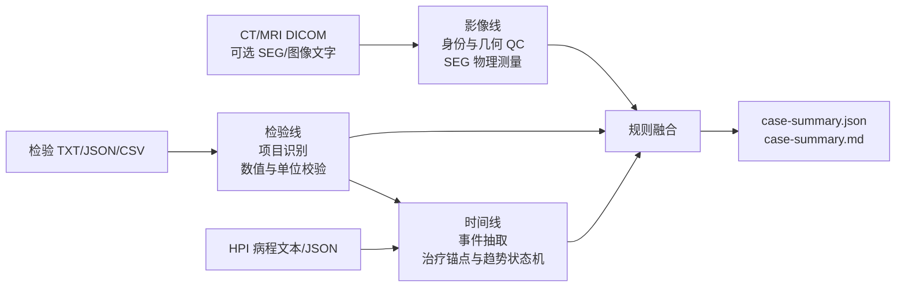

# HCC 多模态：影像 × 检验的 Fail-Closed 证据融合

[English](README.md) | 中文

一个可审计的研究原型：把分割后的 3D 肝脏影像与纵向 AFP/DCP 检验证据做规则化融合——
当几何、单位、配对、配准或报告安全性无法验证时，**拒绝给出结论**（fail-closed）。

它不诊断 HCC，不输出 LI-RADS/BCLC/RECIST/mRECIST 分期，不预测预后，也不提供治疗建议。
每个输出都是带来源的、经 Pydantic 校验的 JSON 工件；每条结论都能追溯到规则 ID。

> **在线演示（合成数据）**：见 [`docs/demo/`](docs/demo/)，本地打开 `docs/demo/index.html`
> 即可，或在 GitHub 上启用 Pages（docs 目录）分享。所有数字均为合成并已标注。

## 为什么是这个项目

多数医疗 AI demo 回答"模型有多准"，本仓库回答另一个问题：

> 多模态管线能否逐个工件地证明"为什么这么说"——并在无法证明时保持沉默？

- 分割掩膜只做**确定性测量**（体素、体积、质心），从不交给语言模型"解读"。
- 纵向病灶用**匈牙利全局分配**配对，明确输出 匹配/新发/消失/分裂/融合/不确定 状态。
- AFP/DCP 趋势保留比较符（`<`、`>=`）、解析状态、参考区间和原始单位；不可用值保持 null，绝不静默补 0。
- **版本化 YAML 规则引擎**融合影像与检验证据，裁决带 reason codes、证据引用和阈值版本。
- LLM（即使启用）只负责把紧凑脱敏证据**渲染**成报告；改锁定字段、编造数字、漏质控、
  下诊断、做分期、给治疗建议或回显注入指令，都会**阻断**报告。确定性渲染器永远兜底。

## 30 秒上手

```powershell
python -m venv .venv
.\.venv\Scripts\python -m pip install -e ".[dev]"
.\.venv\Scripts\hcc-demo run-demo --output demo-output
```

预期裁决为 `concordant_progression_signal`（全合成数据的契约测试，非临床性能证据）。
基础安装不下载模型权重，不需要 CUDA。`.[ocr]`、`.[llm]` 和 `.[imaging-ai]` 是可选能力。

## 能力总览

| 能力 | 命令 | 状态 |
|---|---|---|
| 合成端到端 demo | `hcc-demo run-demo` | ✅ 稳定 |
| 纵向 NIfTI + 掩膜分析 | `hcc-demo analyze` | ✅ 稳定 |
| DICOM CT + SEG 转换（几何 QC） | `hcc-demo convert-dicom-seg` | ✅ 稳定 |
| TCIA HCC_003 公开演示 | `hcc-demo run-public-demo` | ✅ 稳定 |
| 三线病例管线（CT/MR + 检验 + HPI） | `hcc-demo analyze-case` | ✅ 0.4.0 |
| 受控 LLM 报告渲染 + 审计 | `hcc-demo run-deepseek` | ✅ fail-closed |
| 队列评估（bootstrap 区间） | `hcc-demo evaluate-cohort` | ✅ 研究用 |
| 锁定多中心验证工作流 | `hcc-demo validate-research-cohort` … | ✅ 研究用 |
| CPU patch 提取浏览器演示 | `hcc-demo vlm-skeleton-web` | ⚠️ **mock**，无模型 |
| 真实 3D VLM 推理（M3D-LaMed） | — | 🗺️ Roadmap，见下 |

## Roadmap

**真实 3D VLM 推理**已规划，详见 [docs/VLM_WEB_DEMO_PLAN.md](docs/VLM_WEB_DEMO_PLAN.md)：

- 本地 DICOM 去标识化 + 预处理为 `[1,32,256,256]` 张量
- 租用 GPU 仅推理运行 `M3D-LaMed-Phi-3-4B`（不训练）
- 两段式输出：纯影像英文观察 → 受控结构化提取；临床上下文不污染影像观察
- 零张量负控实验证明（或诚实报告不存在）图像条件化
- Mock 演示与真实推理严格分离；失败绝不回退到 mock 输出

仓库中的 connector/训练模块（`vlm_model`、`vlm_training`、`multimodal_connector`、
`visual_tokens`）属于**实验性代码**，不在可信演示路径上。

## 三条证据线



- 影像线：检查 PatientID、UID、方向、位置、spacing、切片顺序和 PHI。有专家 SEG 时计算病灶体积、质心和三维最大范围；没有 SEG 时只保留已有图像工具的定性观察。
- 检验线：支持 AFP、DCP/PIVKA-II、AFP-L3%、肝储备、肝损伤和病毒学项目，保留比较符、单位、参考范围、原文和 span。解析失败、未知单位和缺失值不会被补成 0。
- HPI 线：按真实日期合并治疗、检验和影像事件，识别持续上升、治疗后下降、最低点后反弹等确定性状态。

## 一步式分析

```powershell
python examples\generate_dicom_seg_fixture.py --output synthetic-case
.\.venv\Scripts\hcc-demo analyze-case `
  --dicom-dir synthetic-case\study `
  --seg synthetic-case\seg.dcm `
  --image-evidence examples\image_evidence.synthetic.json `
  --labs examples\lab_report.synthetic.txt `
  --hpi examples\hpi.synthetic.txt `
  --patient-id RESEARCH_001 `
  --output case-output
```

`--seg`、`--image-evidence` 和 `--hpi` 可省略。若 SEG 和结构化影像文字都缺失，影像线输出 `unavailable`；若 HPI 缺失，当前影像和检验仍会分析，但时间趋势标记为不完整。

## 分阶段调试

```powershell
.\.venv\Scripts\hcc-demo parse-imaging --dicom-dir study --patient-id RESEARCH_001 --output imaging.json
.\.venv\Scripts\hcc-demo parse-labs --input examples\lab_report.synthetic.txt --patient-id RESEARCH_001 --output labs.json
.\.venv\Scripts\hcc-demo parse-hpi --input examples\hpi.synthetic.txt --patient-id RESEARCH_001 --labs labs.json --imaging imaging.json --output timeline.json
.\.venv\Scripts\hcc-demo summarize-case --imaging imaging.json --labs labs.json --timeline timeline.json --output case-output
```

详细数据流见 [三线架构说明](docs/THREE_LINE_PIPELINE.md)。真实队列锁定验证仍可使用原有 cohort CLI，见 [真实队列验证说明](docs/REAL_COHORT_VALIDATION.md)。数据与模型权利边界分别见 [DATA_SOURCES.md](DATA_SOURCES.md) 和 [MODEL_SOURCES.md](MODEL_SOURCES.md)。
