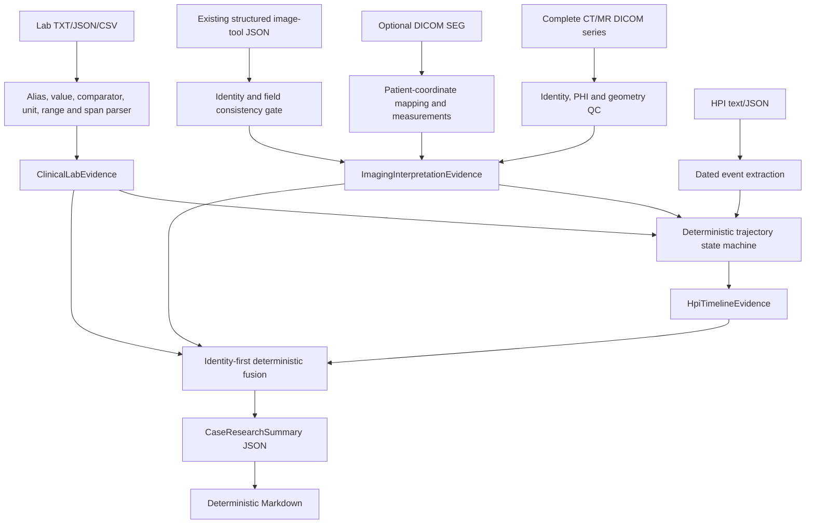

# Three-line CPU case pipeline

Pipeline `0.4.0` keeps schema `1.0.0` and adds four public artifacts:

- `ImagingInterpretationEvidence`
- `ClinicalLabEvidence`
- `HpiTimelineEvidence`
- `CaseResearchSummary`

## Data flow

## Safety behavior

Quantitative imaging values are produced only from a supplied SEG. Image-tool text cannot replace the computed count, volume, centroid, or extent. Unsupported laboratory units and unparseable values remain null and are retained in `rejected_observations`. Relative HPI dates are resolved only when a dated treatment or surgery anchor exists. A single current scan remains `single_timepoint` and cannot become an imaging progression conclusion.

The final renderer filters diagnosis, staging, prognosis, and treatment-recommendation language from promoted key findings. It always includes the fixed research-use disclaimer. An optional future LLM adapter may rewrite validated text, but it must not read raw DICOM, modify locked numbers, or determine the evidence state.

## MRI boundary

MRI v1 supports DICOM identity/geometry checks and structured image-tool observations. Automatic multiphase registration, DWI/ADC interpretation, enhancement-phase classification, and tumor segmentation are not implemented. MR SEG conversion is fail-closed in the current adapter; no pseudo-quantitative measurement is emitted.
